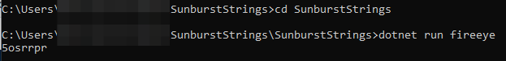

# Sunburst Strings

A quick and dirty dotnet 5.0 lift and shift of the string/domain generation algorithm (DGA) from the Sunburst backdoor into the SolarWinds Orion product.

`dotnet run [domain name here]`
